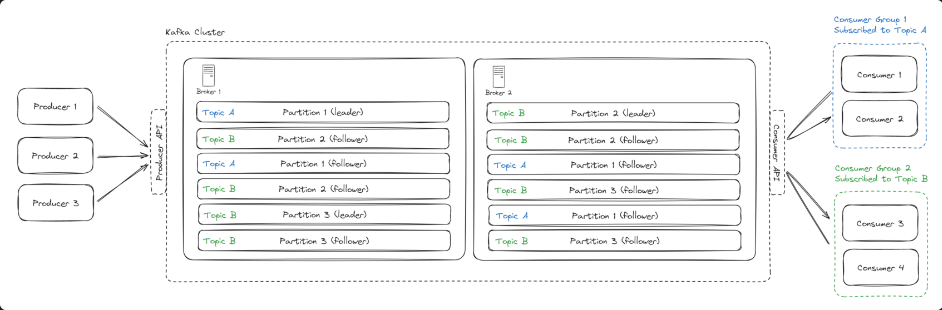

# Kafka

잘 모르기 때문에 정리 해보자

메세지큐, producer 가 생성해서 큐에 넣어주면 컨수머가 가져오는 형태



topic 별로 subscribe 해서 가져옴
각 브로커는 여러개의 파리션을 가질 수 있음
토픽도 여러 파티션을 가질 수 있는데 논리적으로를 의미한다.

브로커 내부에 여러 토픽이 있긴한데 그렇다고 하나의 토픽이 반드시 하나의 브로커에 있는것은 아니다
하나의 토픽이 여러 브로커에 있는 경우도 있다.

이건 좀 다른 이야기 같지만, 리더와 팔로워로 나눠서 장애에 대한 복구나 대처도 가능하다고 한다.

- 분산 처리: 데이터를 파티션으로 나누어 여러 브로커에 분산 저장.
- 복제: 데이터 유실 방지와 고가용성을 위해 동일 데이터를 여러 브로커에 복제.
- 장애 대비: 리더-팔로워 구조로 장애 발생 시 신속한 복구 가능.

키가 있다는데

### 키의 역할

(1) 파티션 결정

- 프로듀서는 메시지를 특정 토픽으로 전송할 때, 해당 메시지가 어떤 파티션에 저장될지를 결정해야 합니다.

- 키는 이를 제어하는 데 사용됩니다:

키가 있는 경우: 키를 기반으로 파티션을 계산합니다.

기본적으로 키 해싱 알고리즘을 사용하여 특정 파티션에 매핑.
동일한 키를 가진 메시지는 항상 같은 파티션에 저장됩니다.

키가 없는 경우: 라운드로빈 방식 또는 사용자 정의 파티셔너를 사용해 파티션을 무작위로 결정.

메시지 처리 순서 보장(파티션 내부에서)
동일한 키를 가진 메시지는 항상 같은 파티션에 저장되므로 파티션 내에서 순서가 보장됩니다.
컨슈머가 파티션을 순차적으로 읽기 때문에 동일 키의 메시지는 입력 순서대로 처리됩니다.

예를 들자면 이런 식으로

partition = hash(key) % number_of_partitions

### 키 사용의 주의점

키의 편향 문제:

잘못된 키 설정으로 인해 특정 파티션에 데이터가 몰릴 수 있습니다(파티션 핫스팟 문제).
예: 전체 메시지가 동일한 키를 가진 경우, 모든 메시지가 하나의 파티션에 집중.

파티션 변경:

토픽의 파티션 수가 변경되면 기존 키 해싱 계산이 달라져 데이터가 다른 파티션으로 이동할 수 있음.


카프카는 디비가 아니야 너무 많이 들고 있는건 좋지 않아
네트워크 1메가 이하로 유지하기 위해서 메세지 하나의 크기가 작아야한다 1메가 이하 추천 그래야 네트워크 이용 시 큰 무리가 안간다?

좋은 하드웨어면
a single broker can store around 1TB of data and handle around 10,000 messages per second 이렇대

Scability

Horizontal Scaling With More Brokers
- 가장 간단한 방법으로 브로커를 늘려서 확장하는 방법. 브로커를 늘리면 토픽 파티션도 늘려서 좀 더 많은 데이터 처리가 가능

Partitioning Strategy
- 파티셔닝 전략인데 key 를 이용한 방법이라고 한다 해시를 이용해서 특정 파티션으로 producing 이 가능한데 잘 써야 한다.
잘못쓰면 한 파티션만 부하 걸림

### Hot partition 다루는 방법 

Random partitioning with no key
- 키를 제공하지 않으면 Kafka는 무작위로 메시지에 파티션을 할당하여 균등한 배포를 보장합니다. 단 순서 보장이 안됩니다.

Random salting
- 파티션키 생성시 임의의 소팅 값을 넣어서 만드는 방법.  나중에 컨수머 쪽에서 복잡도가 증가할 수 있지만, 파티션을 균등하게 분포시킬 수 있다.

Use a compound key
- id 만 이용하는게 아니라 지리위치라던가 유저 아이디 같은 다른 정보를 같이 써서 compound key 를 만들어서 쓰는거다

Back pressure
- 이건 그냥 가능하다면 프로듀서가 파티션으로 쏘는것을 너무 부하가 심하다고 생각하면 천천히 보내는거

### Fault Tolerance and Durability

리더와 팔로워
다 파티션이다 역할이 다를뿐

리더 : read write 를 하는 녀석
팔로워 : 리더의 replica

Ack 옵션 
1) acks=1: 리더가 데이터를 받으면 바로 확인 응답(최소 성능 우선).
2) acks=all: ISR에 속한 모든 팔로워가 데이터를 복제한 후 응답(최대 안전성 우선).
3) acks=0: 프로듀서는 리더의 응답을 기다리지 않음(최대 속도 우선).

ISR(In-Sync Replica)**는 현재 리더와 동기화된 상태를 유지하고 있는 팔로워들의 목록입니다.


### Consumer 다운되면 무슨일이?

다운되면 문제가 안되기 위한 메커니즘이 2개 있다.
소개하자면

Offset Management
- consumer 가 잘 처리하면 나 여기까지 처리했어 라고 카프카한테 알려준다. 이렇게 하는 이유는 consumer 가 다시 시작된 경우 어디까지 자기가 받아갔는지
알수가 없지만 이걸 카프카한테 물어보면 알 수 있기 때문이다.

Rebalancing
- 하나 다운되면 컨수머 그룹이 있으면 그 그룹 리밸런싱을 한다.

#### 잠깐!  컨수머와 파티션의 사이즈가 같을때가 가장 잘 돌아간다
컨수머 > 파티션 → 노는 컨수머 생김
파티션 > 컨수머 → 컨수머가 바쁘게 돌아감 (하나의 컨슈머가 여러 파티션을 처리합니다.)

리밸런싱 좀 더 살펴보자
- 리밸런싱 되는 과정에서 컨수밍이 멈추게 되는데 이 경우 중복이 발생할 수 있다.

예를 들어 9번 처리를 하고 커밋을 못한채 리밸런싱 발생하면 새로 컨수머가 붙었을떄 9번을 또 처리할 수 있따

#### Handling Retries and Errors

Producer Retries
프로듀서는 자동 리트라이를 지원한다.
```javascript
const producer = kafka.producer({
        retry: {
        retries: 5, // Retry up to 5 times
        initialRetryTime: 100, // Wait 100ms between retries
        },
        idempotent: true,
    });
```

잘못 전송됐다고 생각할때 단 한번만 전송하는것을 보장한다.

#### Consumer Retries

- AWS SQS consumer 의 재시도를 지원한다. 카프카는 일반적으로 지원하지 않아 재시도 큐에 보낼 수 있는 별도의 컨수머를 만들어서 써야한다.

#### 최적화

- 압축하는 방법으로 성능을 올릴 수 있다.
- 배치로 묶어 전송하면, 여러 메시지를 하나의 요청으로 처리하므로 네트워크 사용량 감소.

**단, 배치가 너무 크면 부하가 생길 수는 있다**.

#### Retention Policies

카프카가 들고 있는 보관기간? 같은거를 설정할 수 있따. 7일 1GB 이런식으로