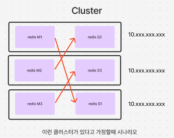
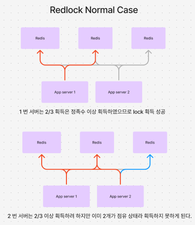
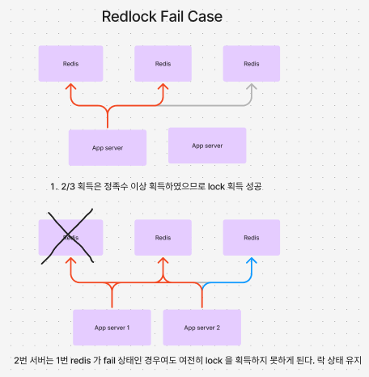
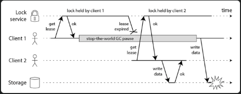
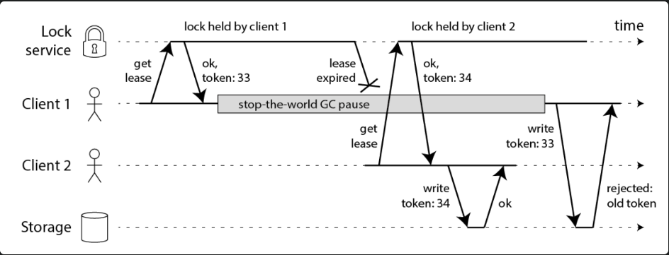

# Red Lock Algorithm

### What?

Red lock algorithm 은 무엇인가? 

- redis 에서 lock 획득시 하나만 획득하는것이 아닌 정족수(과반수) 이상을 획득해야 획득한 것으로 간주한다.

### Why?

- 여러 이유가 있겠지만, 그 중 한 가지를 소개하자면, Cluster 상황에서의 문제가 있다.

### Cluster Case

총 6대의 redis 가 Master-Slave 구조로 연결되어 있다고 가정 (3개의 master, 3개의 slave)

#### Detail

1. 1번 서버가 락 키를 M1에서 획득(key set)
2. M1 에서 S1로 복제하기 전에 M1 down
3. 2번 서버가 동일한 락 키가 있는지 확인
4. 락 키가 복지하기전 M1 이 다운되었으므로 setting 된 key 가 없어 없다고 생각하고 로직 수행
**5. 1번 서버와 2번 서버가 동시에 실행(문제 발생)**

이 경우 문제가 발생한다. RedLock 알고리즘은 이런 경우를 방지한다.

### RedLock Case

Red lock Algorithm 을 살펴보자면, Redis 서버가 3대 있고 2개의 서버가 붙어있는 경우이다.

1번 서버가 1,2번 레디스에서 락을 획득한 상태이면 2번 레디스가 동일한 키로 락 획득을 할 수 없어 동시에 실행하는 경우가 없어진다.

**RedLock 은 fail 상태에서도 이를 보장하는데 살펴보자**

#### Detail

1. 1번 서버가 1,2 번 레디스 에서 락 키를 획득한다.
2. 1번 레디스가 down
3. 2번 서버가 키 획득을 하려하지만 정족수 이상을 획득하지 못하기 때문에 락 상태가 유지된다.

Red Lock 은 이런식으로 fail 을 방지한다.

### Mechanism

1. 레디스들의 락 키를 시도한다.
2. 획득한 락 키가 정족수 이상인지 확인한다.
3. 락 키를 획득 후 시간이 만료시간을 지났는지 확인한다.
4. 지나지 않았다면 수행한다.
5. 수행 후 락 키를 반환한다.

### 한계

이런 완벽해보이는 red lock 알고리즘도 한계가 있는데 아래 상황을 살펴보자

시나리오 설명
1. 1번 서버가 락 획득을 성공한다.
2. 1번 서버가 STW 가 발생한다.
3. 1번 서버의 락 키 타임아웃이 발생한다.
4. 2번 서버가 락 키 획득을 시도하는데 1번서버가 타임아웃이 발생하였으므로 성공한다.
5. 1번 서버의 STW 가 풀렸다.
**6. 1번 서버, 2번 서버 가 동시에 로직을 수행한다**

그래서 이것을 방지하기 위해서 Fencing Token 방법이 존재한다.

위 시나리에서 6번에서 2번이 먼저 수행하고 1번이 수행하는 과정에서 토큰 값이 시작할 때와 달라 reject 이 되게 되어
문제가 발생하지 않는다.
디비에서 Versioning 과 유사해 보인다.

하지만, 이 방법도 결국 token 이 SPOF 가 된다는 점이 한계이긴 하다.