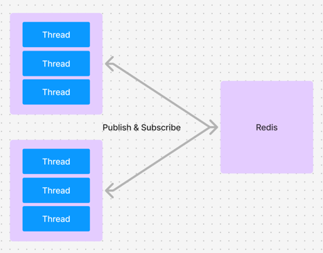
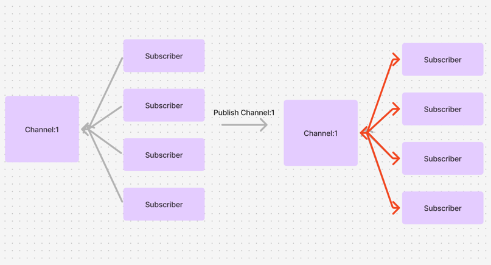
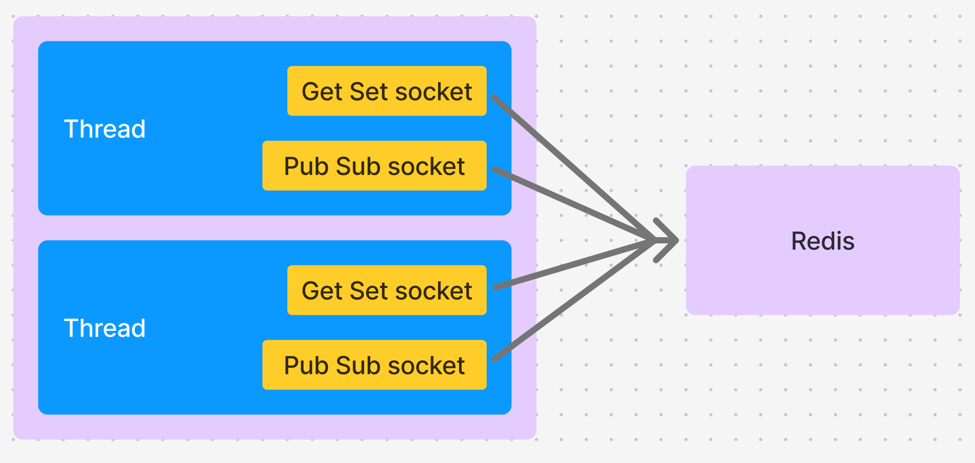
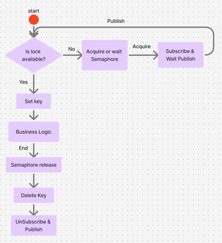
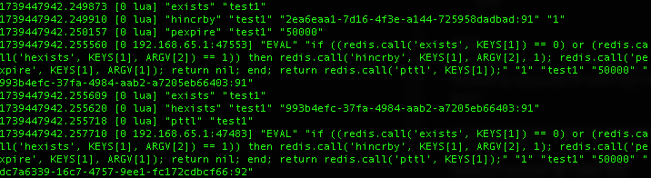
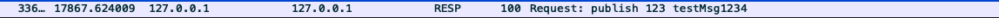

# PubSub

- Publish & Subscribe

#### Redisson PubSub 이란

분산락 사용시 Redis 의 클라이언트인 Redisson 에서 Redis 의 publish subscribe 를 이용해서 분산락 구현



구조를 살펴보자면 단순하게 위와 같은 구조이다. 여러 서버가 하나의 Redis 를 바라보고 있다.

기본적으로 Publish 와 Subscribe 는 하나의 채널을 두고 해당 채널을 구독하는 형태이다.



이런식으로 publish 이벤트가 발생하면 subscriber 들에게 해당 이벤트가 발생했음을 알려준다.
이것을 분산락에 어떻게 이용할 수 있을까?

기본적으로 분산락은 해당 키가 있는 경우 기다림으로써 동시에 실행되는것을 방지하기 위해서 동작한다. 단순하게는 키 값이 있는지 지속적으로 확인하는
방법이 있지만(Spin lock 방식) 이 방식은 레디스에 많은 부하가 갈 수 있어 고안된 방법이 pub&sub 을 이용한 방식이다.

락 점유를 하고 있던 Thread 에서 작업을 마치면 publish 명령을 날려 다른 기다리고 있는 Thread 들이 락 키를 점유하게 하는 방식이다.
이렇게 하면 계속 키의 유무를 확인하기위한 spin lock 방식보다 redis 에 부하를 덜 주게 된다.

Redisson 에서는 이 마저도 더 최적화 하기 위해 Semaphore 를 이용하고 connect 을 서버당 하나만 가져갈 수 있게 구현해 두었다.
하지만, 우선은 각 Thread 에서 connection 을 등고 있는 형태로 구현해보려고 한다.
많은 소켓 생성을 막기 위해서 Thread Local 을 사용해 보았다. 시나리오를 그림으로 나타내보자



이런식으로 각 Thread 안에 소켓이 있고 그 소켓이 Redis 와 pub & sub 관계를 가지고 있는 형태이다.

통신을 살펴 보았으니 락 획득 및 실행 시나리오를 살펴보자



키가 없는 경우
1) 키가 있는지 확인 후 키 set
2) 비지니스 로직 수행
3) semaphore acquire 한 경우라면 release
4) key 삭제
5) unsubscribe & publish

키가 이미 있는 경우
1) 키가 있는 경우 semaphore 획득
2) 획득을 했다면, subscribe 즉 semaphore 개수 만큼만 subscribe 하게된다.
3) subscribe 후 publish 대기
4) publish 발생시 lock key 획득가능한지 여부 확인
5) 획득했다면 키가 없는 경우 flow 를 타게된다.

### Deep Dive

#### Why?

1. GetSet & PubSub Socket 이 나뉘어져 있는 이유

위 그림을 자세히 보면 하나의 쓰레드에 소켓이 2개인것을 볼 수 있다. 이렇게 나뉘어져 있는 이유가 있다.
GetSet 을 하기 위해선 키가 있는지 확인하고 없으면 setting 하는 과정을 원자적으로 묶기 위해 luaScript 를 사용하였다.

```kotlin
if (redis.call('exists', KEYS[1]) == 0) then
    return redis.call("SET", KEYS[1], ARGV[1], "EX", ARGV[2])
else
    return nil
end
```

이렇게 사용한 소켓에서 subscribe 확인시 혹은 subscribe 사용했던 소켓을 Get&Set 으로 이용하려고 하면 문제가 발생했다.
그래서 PubSub socket 과 GetSet Socket 을 분리하여 쓰게 되었다.

### TODO

1. key 를 lua script 로 가져올때 실패시 다시 publish 이벤트가 발생하지 않아 무한 대기하는 문제

### 번외

channel 을 subscribe 한 client 들은 Publish 이벤트 발생시 과연 진짜 깨어나서 락 획득을 시도할까?

이 궁금증을 해결하기 위해 몇 가지 방법이 있는데 2가지를 시도해보았다.

**redis-cli monitor 를 이용한 방법**

redis-cli 를 이용하면 redis server 를 모니터링 하듯 볼 수 있다.



이런 식으로 여러 클라에서 값 획득을 시도하는 것을 볼 수 있다.

2번째 방법으로는 wireshark 를 이용하는 방법이 있는데 나의 경우엔 로컬이어서 lo 를 기준으로 캡쳐를 하였다.

```kotlin
tcp.port == 6379
```

이런식으로 포트를 기준으로 필터를 하면 패킷도 확인할 수 있다.




